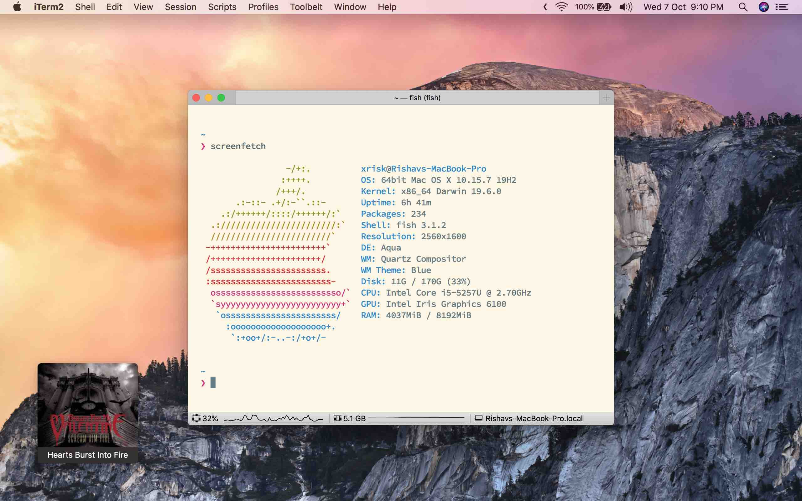

# d o t s

I prefer things that work OOTB™. The best config is no config.

macOS apps
==========

* [magnet](https://magnet.crowdcafe.com) - basic window management
* [karabiner](https://karabiner-elements.pqrs.org/) - do useful things like map ctrl+hjkl to arrow keys
* [fluor](https://fluorapp.net/) - toggle the fn layer for when I'm playing Dota 
* [iterm2](https://www.iterm2.com/) - great (and I mean *great*) tmux integration, truecolor support
* [NepTunes](https://micropixels.software/neptunes) - lastfm scrobbler for use with Apple Music 
* [Hidden Bar](https://github.com/dwarvesf/hidden) - hide menu bar items

more stuff in `Brewfile`

notes | work | writing
====================================

* notion - basic, good, easy
* zotero - open source, use [better-bibtex](https://retorque.re/zotero-better-bibtex/)
* nvim

(n)vim stuff
===========

* vim-sleuth - autodetect indentation settings
* vimtex - just works™, syncs with Skim.app
* vim-commentary - why is this not upstreamed?
* YouCompleteMe - works well without config (seriously, I don't have the time to set up 50 LSPs)

Full config at `~/.config/nvim/init.vim`.

fave fonts
==========

* SF Pro / Mono
* Inter
* Baskerville (great for academic writing)
* Source Code Pro
* Helvetica (old but golde)
* Inconsolata

more stuff in my Brewfile

